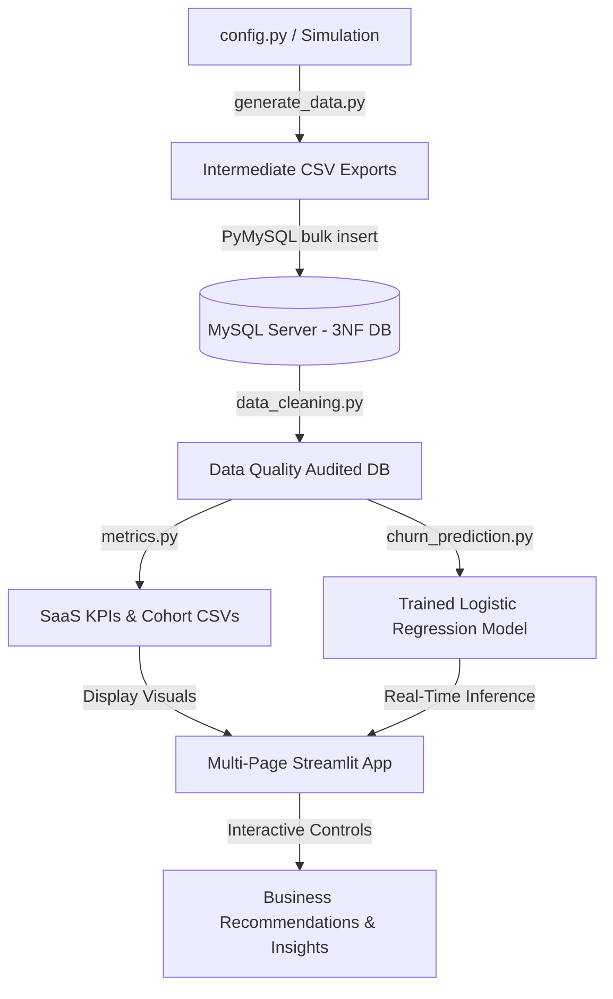
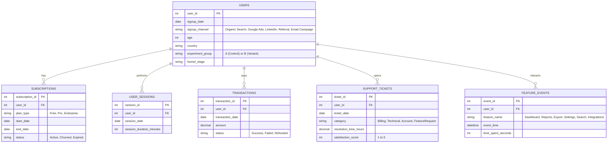

# Product Analytics Platform for SaaS Customer Intelligence

Designed and analyzed a normalized relational database (3NF) containing users, subscriptions, transactions, feature usage, and support interactions to derive product KPIs, build interactive dashboards, and generate data-driven recommendations for improving user retention and engagement.

---

## 🚀 Tech Stack
* **Language**: Python (Pandas, NumPy)
* **Database**: MySQL (3NF Normalized Relational Schema)
* **Machine Learning**: Scikit-learn (Logistic Regression Pipeline)
* **Visualization**: Streamlit (Multi-page Interactive Dashboard), Plotly (Interactive Graphs)
* **Environment Configuration**: Dotenv (.env file configuration)

---

## 🛠️ System Architecture



---

## 📊 Database Design & ER Diagram (3NF Normalization)
This platform implements a normalized database schema in **Third Normal Form (3NF)** to enforce data integrity, minimize redundancies, and speed up query executions.



---

## 📈 Calculated Product KPIs
The analytics engine parses the MySQL tables to calculate:
* **DAU (Daily Active Users)**: Distinct daily logins tracking immediate active reach.
* **MAU (Monthly Active Users)**: Distinct monthly logins tracking broader active reach.
* **Stickiness (DAU/MAU)**: Measures user habit formation.
* **Churn Rate**: Tracks percentage of users leaving the platform.
* **Average Revenue Per User (ARPU)**: Evaluates monetization efficiency.
* **Customer Lifetime Value (CLV)**: Projected lifetime revenue.
* **Conversion Rate**: Rate at which Free signups upgrade.

---

## ⚡ SQL Concepts Demonstrated
The 30 advanced SQL queries inside `sql/analysis_queries.sql` demonstrate core relational query mechanics:
* **JOINs**: INNER and LEFT JOINs to link user sessions, tickets, features, and subscriptions.
* **CTEs**: Common Table Expressions for readability and structured calculations.
* **Window Functions**: Performing rankings (`DENSE_RANK() OVER (PARTITION BY ... ORDER BY ...)`) and averages.
* **Aggregate Functions**: Calculations like `SUM`, `AVG`, and `COUNT`.
* **Conditional Logic**: `CASE WHEN` to segment users and calculate rates.
* **Date Functions**: `DATE_FORMAT` and `DATEDIFF` to track time metrics.

---

## 💡 Key Business Insights
* **Inactivity Risk**: Users inactive for **more than 14 days** have a significantly higher churn risk.
* **Feature Stickiness**: Pro and Enterprise users use the **Export** feature most frequently. First-week adoption of Export correlates with low churn.
* **Channel Performance**: **Referral** users show the highest retention rate and lowest support load, whereas Google Ads have high signups but 22% higher churn.
* **Support Friction**: Customers submitting **3+ support tickets in a month** represent immediate churn risk, especially if ticket SLA resolution time exceeds **24 hours**.

---

## 📂 Project Structure
```
product-analytics-dashboard/
├── .env                              # MySQL credentials config
├── config.py                         # Central simulation configuration parameters
├── README.md                         # This file
├── requirements.txt                  # Python dependencies
├── data/                             # Intermediate CSV exports
│   ├── users.csv
│   ├── subscriptions.csv
│   ├── user_sessions.csv
│   ├── feature_events.csv
│   ├── transactions.csv
│   └── support_tickets.csv
├── docs/                             # Metric documentation
│   └── metrics_dictionary.md
├── models/                           # Logistic Regression model binary
│   └── churn_lr_model.pkl
├── outputs/                          # Calculated SaaS KPIs
│   ├── kpis.csv
│   ├── ab_test_metrics.csv
│   └── cohort_retention.csv
├── scripts/
│   ├── generate_data.py              # Generates data, saves CSVs, and loads into MySQL
│   ├── data_cleaning.py              # Outlier detection and data quality audits
│   ├── metrics.py                    # Calculations for KPIs, cohorts, A/B metrics
│   └── churn_prediction.py           # Logistic Regression trainer
├── sql/
│   └── analysis_queries.sql          # 30 advanced SQL queries
├── app/
│   ├── dashboard.py                  # Multi-page Streamlit dashboard
│   └── screenshots/                  # Capture and save your dashboard screenshots here
└── reports/
    └── business_recommendations.md   # Actionable product insights
```

---

## 💻 Installation & Setup

1. **Clone the directory and install python dependencies:**
   ```powershell
   cd product-analytics-dashboard
   pip install -r requirements.txt
   ```
2. **Setup your environment variables:**
   Open the file `.env` and set your local MySQL connection details (Username, Password, Port).
3. **Run the data pipeline script:**
   This generates data, exports backup CSVs to `data/`, and uploads everything to MySQL.
   ```powershell
   python scripts/generate_data.py
   ```
4. **Run the query reporter and cleaning audit:**
   ```powershell
   python scripts/data_cleaning.py
   python scripts/run_queries.py
   ```
5. **Run the model training pipeline:**
   ```powershell
   python scripts/metrics.py
   python scripts/churn_prediction.py
   ```
6. **Launch the dashboard application:**
   ```powershell
   streamlit run app/dashboard.py
   ```

---

## 🖼️ Dashboard Preview
*(Once you launch the dashboard locally, capture screenshots and drop them in the `app/screenshots/` folder to populate your GitHub README)*

### Overview Dashboard


### Product Funnel


### Churn Prediction Tool


### Feature Analytics

